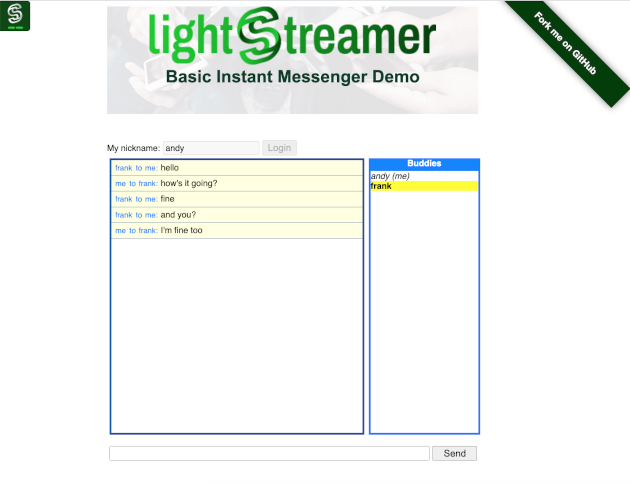

# Lightstreamer - Basic Messenger Demo - HTML Client #

<!-- START DESCRIPTION lightstreamer-example-messenger-client-javascript -->
The *Basic Messenger Demo* is a very simple instant messenger application based on Lightstreamer for its real-time communication needs.

This project includes a simple web client front-end for the *Basic Messenger Demo*.

As an example of [Lightstreamer Adapters Needed by This Client](https://github.com/Lightstreamer/Lightstreamer-example-Messenger-client-javascript#lightstreamer-adapters-needed-by-this-client), you may refer to the [Lightstreamer - Basic Messenger Demo - Java Adapter](https://github.com/Lightstreamer/Lightstreamer-example-Messenger-adapter-java).

## Live Demo

### [ View live demo](https://demos.lightstreamer.com/MessengerDemo/)

## Details

The Basic Instant Messenger Demo shows an extremely simple version of a typical messenger, where messages can be delivered to a specific friend, chosen from a dynamic list of online buddies.

Choose a nickname and click Login. You will see a list of all users connected to this demo, with their nicknames. Write a message and choose a recipient. The message will be delivered only to him/her (rather than broadcasting it, as the [Lightstreamer - Basic Chat Demo - HTML Client](https://github.com/Lightstreamer/Lightstreamer-example-chat-client-javascript) does).

Launch multiple instances of the demo, possibly on different machines, to populate the Buddies list. If you use the same nickname on different instances, you will actually embody the same identity (to keep things simple, no authentication is used).

The front-end code can be considered a reference example of one-to-one messaging. Each user subscribes to their personal item (corresponding to the nickname), so that messages can be routed properly, instead of begin broadcast (as in the [Lightstreamer - Basic Chat Demo - HTML Client](https://github.com/Lightstreamer/Lightstreamer-example-chat-client-javascript), where all the users subscribe to the same item). In real applications, where authentication is used, the Metadata Adapter should enforce the association between the user's identity and the item they have the right to subscribe to. 

The demo includes the following client-side functionalities:
* A [Subscription](https://lightstreamer.com/api/ls-web-client/latest/Subscription.html) containing 1 item, subscribed to in `DISTINCT` mode feeding a [DynaGrid](https://lightstreamer.com/api/ls-web-client/latest/DynaGrid.html) (showing all the personal messages).
* A [Subscription](https://lightstreamer.com/api/ls-web-client/latest/Subscription.html) containing 1 item, subscribed to in `COMMAND` mode feeding a [DynaGrid](https://lightstreamer.com/api/ls-web-client/latest/DynaGrid.html) (showing the updated buddy list).
* The messages are sent to the Lightstreamer Server using the [LightstreamerClient.sendMessage](https://lightstreamer.com/api/ls-web-client/latest/LightstreamerClient.html#sendMessage) utility.

<!-- END DESCRIPTION lightstreamer-example-messenger-client-javascript -->

## Install
If you want to install a version of this demo pointing to your local Lightstreamer Server, follow these steps:
* As prerequisite, the [Lightstreamer - Basic Messenger Demo - Java Adapter](https://github.com/Lightstreamer/Lightstreamer-example-Messenger-adapter-java) has to be deployed on your local Lightstreamer Server instance. Please check out that project and follow the installation instructions provided with it.
* Download this project.
* Get the `lightstreamer.min.js` file from [npm](https://www.npmjs.com/package/lightstreamer-client-web) or [unpkg](https://unpkg.com/lightstreamer-client-web/lightstreamer.min.js) and put it in the `src/js` folder. 
* Get the `require.js` file form [requirejs.org](http://requirejs.org/docs/download.html) and put it in the `src/js` folder.
* Deploy this demo on the Lightstreamer Server (used as Web server) or in any external Web Server. If you choose the former, please note that in the `<LS_HOME>/pages/demos/` folder, there may be already a `MessengerDemo` folder. If this is not your case, please create the folders `<LS_HOME>/pages/MessengerDemo` and copy here the contents of the `/src` folder of this project.
The client demo configuration assumes that Lightstreamer Server, Lightstreamer Adapters, and this client are launched on the same machine. If you need to target a different Lightstreamer server, please search in `js/lsClient.js` this line:  
`var lsClient = new LightstreamerClient(protocolToUse+"//localhost:"+portToUse,"MESSENGER");`  
and change it accordingly.
* Open your browser and point it to: [http://localhost:8080/MessengerDemo/](http://localhost:8080/MessengerDemo/)

## See Also

### Lightstreamer Adapters Needed by This Client
<!-- START RELATED_ENTRIES -->

* [Lightstreamer - Basic Messenger Demo - Java Adapter](https://github.com/Lightstreamer/Lightstreamer-example-Messenger-adapter-java)

<!-- END RELATED_ENTRIES -->

### Related Projects

* [Lightstreamer - Basic Chat Demo - HTML Client](https://github.com/Lightstreamer/Lightstreamer-example-Chat-client-javascript)

## Lightstreamer Compatibility Notes #

- Compatible with Lightstreamer JavaScript Client library version 6.0 or newer (installation instructions for version 8.0 or newer).
