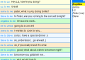

# Lightstreamer - Basic Messenger Demo - HTML Client #

<!-- START DESCRIPTION -->

This project includes a simple web client front-end example for the [Lightstreamer - Basic Messenger Demo - Java Adapter](https://github.com/Weswit/Lightstreamer-example-Messenger-adapter-java).

<table>
  <tr>
    <td style="text-align: left">
      &nbsp;<a href="http://demos.lightstreamer.com/MessengerDemo" target="_blank"></a>&nbsp;
      
    </td>
    <td>
      &nbsp;An online demonstration is hosted on our servers at:<br>
      &nbsp;<a href="http://demos.lightstreamer.com/MessengerDemo" target="_blank">http://demos.lightstreamer.com/MessengerDemo</a>
    </td>
  </tr>
</table>

The Basic Instant Messenger Demo shows an extremely simple version of a typical messenger, where messages can be delivered to a specific friend, chosen from a dynamic list of online buddies.<br>
Choose a nick-name and click Login. You will see a list of all users connected to this demo, with their nicknames. Write a message and choose a recipient. The message will be delivered only to him/her (rather than broadcasting it, as the [Lightstreamer - Basic Chat Demo - HTML Client](https://github.com/Weswit/Lightstreamer-example-chat-client-javascript) does).<br>

Launch multiple instances of the demo, possibly on different machines, to populate the Buddies list. If you use the same nick-name on different instances, you will actually embody the same identity (to keep things simple, no authentication is used).<br>

The front-end code can be considered a reference example of one-to-one messaging. Each user subscribes to their personal item (corresponding to the nick-name), so that messages can be routed properly, instead of begin broadcast (as in the [Lightstreamer - Basic Chat Demo - HTML Client](https://github.com/Weswit/Lightstreamer-example-chat-client-javascript), where all the users subscribe to the same item). In real applications, where authentication is used, the Metadata Adapter should enforce the association between the user's identity and the item they have the right to subscribe to.<br>

The demo includes the following client-side technologies:
* A [Subscription](http://www.lightstreamer.com/docs/client_javascript_uni_api/Subscription.html) containing 1 item, subscribed to in DISTINCT mode feeding a [DynaGrid](http://www.lightstreamer.com/docs/client_javascript_uni_api/DynaGrid.html) (showing all the personal messages).
* A [Subscription](http://www.lightstreamer.com/docs/client_javascript_uni_api/Subscription.html) containing 1 item, subscribed to in COMMAND mode feeding a [DynaGrid](http://www.lightstreamer.com/docs/client_javascript_uni_api/DynaGrid.html) (showing the updated buddy list).
* The messages are sent to the Lightstreamer Server using the [LightstreamerClient.sendMessage](http://www.lightstreamer.com/docs/client_javascript_uni_api/LightstreamerClient.html#sendMessage) utility.
* 

<!-- END DESCRIPTION -->


# Deploy #

Before you can run the demo some dependencies need to be solved:

-  Get the lightstreamer.js file from the [latest Lightstreamer distribution](http://www.lightstreamer.com/download) 
   and put it in the src/[demo_name]/js folder of the demo (if that is the case, please create it). Alternatively you can build a lightstreamer.js file from the 
   [online generator](http://www.lightstreamer.com/distros/Lightstreamer_Allegro-Presto-Vivace_5_1_1_Colosseo_20130305/Lightstreamer/DOCS-SDKs/sdk_client_javascript/tools/generator.html).
   In that case be sure to include the LightstreamerClient, Subscription, DynaGrid, and StatusWidget modules and to use the "Use AMD" version.
-  Get the require.js file form [requirejs.org](http://requirejs.org/docs/download.html) and put it in the src/[demo_name]/js folder of the demo.

You can deploy this demo in order to use the Lightstreamer server as Web server or in any external Web Server you are running. 
If you choose the former case please note that in the <LS_HOME>/pages/demos/ folder there is a copy of the /src directory of this project, if this is non your case please create the folders <LS_HOME>/pages/demos/MessengerDemo then copy here the contents of the /src folder of this project.<br>
The client demo configuration assumes that Lightstreamer Server, Lightstreamer Adapters and this client are launched on the same machine. If you need to targeting a different Lightstreamer server please search this line:
```js
var lsClient = new LightstreamerClient(protocolToUse+"//localhost:8080","MESSENGER");
```
in js/lsClient.js file and change it accordingly.<br>
Anyway the [SIMPLE_MESSENGER](https://github.com/Weswit/Lightstreamer-example-Messenger-adapter-java) and [IMMetadataAdapter](https://github.com/Weswit/Lightstreamer-example-Messenger-adapter-java) Adapters have to be deployed in your local Lightstreamer server instance. The factory configuration of Lightstreamer server already provides this adapter deployed.<br>
The demo are now ready to be launched.

# See Also #

## Lightstreamer Adapters needed by this demo client ##

* [Lightstreamer - Basic Messenger Demo - Java Adapter](https://github.com/Weswit/Lightstreamer-example-Messenger-adapter-java)

## Similar demo clients that may interest you ##

* [Lightstreamer - Basic Chat Demo - HTML Client](https://github.com/Weswit/Lightstreamer-example-Chat-client-javascript)

# Lightstreamer Compatibility Notes #

- Compatible with Lightstreamer JavaScript Client library version 6.0 or newer.
